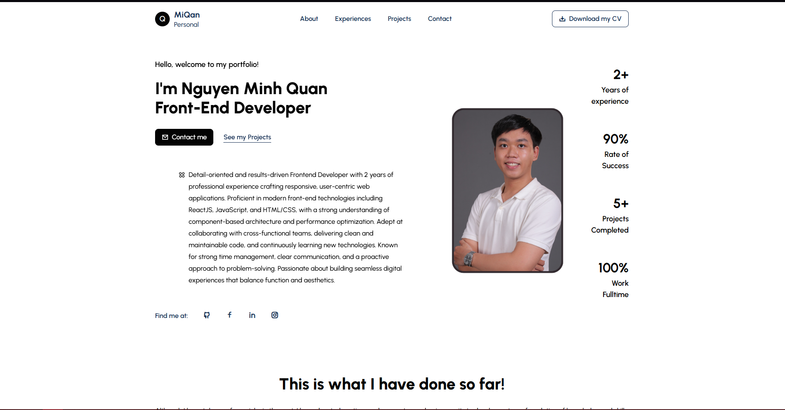

# 🧑‍💻 Personal Portfolio

Welcome to my personal portfolio! This website showcases my experience, skills, and projects as a Frontend Developer. Built with modern technologies like **React**, **TailwindCSS**, and **JavaScript**, it serves as both a professional profile and a collection of my best work.

## 🚀 Live Demo

Check out the live site here: [miqan-portfolio.vercel.app](https://miqan-portfolio.vercel.app)

## 🛠 Tech Stack

- **Framework**: React
- **Language**: JavaScript
- **Styling**: Tailwind CSS
- **Animation**: AOS (Animation On Scroll)
- **Deployment**: Vercel
- **Other Tools**: ESLint, Prettier

## 📂 Features

- Responsive and mobile-friendly design
- Smooth page transitions and animations
- Project showcase with descriptions and links
- Contact form / email integration

## 📸 Preview

